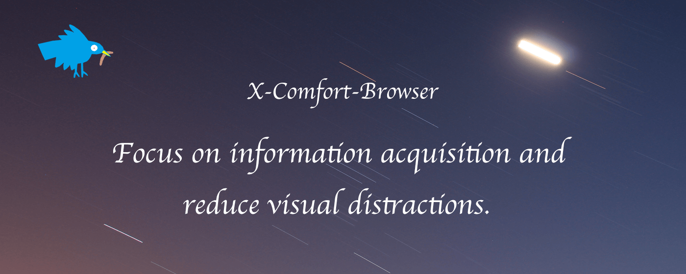

export const Music = () => (
  <iframe
    frameborder="no"
    border="0"
    marginwidth="0"
    marginheight="0"
    width="100%"
    height="86"
    src="//music.163.com/outchain/player?type=2&id=1996073639&auto=1&height=66"
  />
);

> “观察自己发现，其实不是注意力不集中，而是注意力非常容易集中，比如一个小红点，一条信息，都会让自己从放空的状态中跳出来，进入到具体的事物中去。
> 或许问题不该是如何集中注意力，而是想办法把环境中容易吸引注意力的事物挪掉。
> 更深处的原因，则是这些自己对于「存在」的焦虑，所以任何社交媒体/工具的反馈，总是能第一时间得到自己关注及行动，以便再次确认自己「存在」且「有价值」。”
> —— 产品沉思录 Vol.029



<Music />

## 前言

&emsp;&emsp;信息成瘾和注意力的夺取，在互联网上，平台和用户之间互相形成了彼此同构的势力：
平台通过设计产品的细节给用户以信息反馈（如小红点，精准的内容推荐）使用户养成对这种反馈机制的习惯，来保存用户的活跃度；
从用户角度，为了更多的流量的媒体和帐号，在发布的内容中精心的挑选和设计，穿插一些可能无关联甚至吸引性的图片。
图片的滥用和视频的干扰，形成了一种噪音，使得纯文字的阅读和表达能力在这视觉的转移运动中逐渐削弱。

&emsp;&emsp;如何获取更多的注意力主动权，保护自己的时间和行为价值，就像做眼保健操一样，是在“课前”需要逐渐的养成良好习惯。

&emsp;&emsp;另外推特这样的内容开放的平台，在公共场合浏览时，有可能跳出一两条不合时宜的图片，让自己老脸一红或措手不及。

&emsp;&emsp;因为这样的出发点，顺手也想尝试下浏览器插件的开发，便产生了 [X-Comfort-Browser](https://github.com/dnevend/x-comfort-browse/) 这个逛推特的小工具。

## 开发

### 框架选择

&emsp;&emsp;在插件阵营，Webkit（Chrome、Edge、Safari、360...）和 Gecko（Firefox）两种不同内核的浏览器分占两壁江山。开发模式也存在差异，好在已有成熟的框架可以兼容开发，能省去不少开发前的琐事。

[Plasmo (10.5k)](https://www.plasmo.com/) 和 [WXT (4.4k)](https://wxt.dev/) 对 Typescript 和多种前端框架都做了支持，可以根据自己的技术偏好来进行选择。

只因为是先了解到了 WXT，所以这个插件就基于 WXT 来进行开发。

### 插件构成

- Manifest.json 配置文件：定义插件的基本信息和权限。

- Popup 弹窗页面：用户界面，展示信息和接收用户输入。

- Content Script：内容脚本，用于与网页内容交互。

- Background Script：后台脚本，处理长期任务和事件。

- 其他组件：如 Options 页面、Browser Action、Page Action、通信机制等。

### 核心代码

```typescript title="content.ts"
import { defineContentScript } from "wxt/sandbox";
import { defaultBlur, storageKeys } from "@/const";
import { createButton } from "@/utils";

const BLUR_EMOJI = "👀";
const UN_BLUR_EMOJI = "🙈";

// 元素状态
const statusMap = new Map<string, boolean>();

// 资源选择器（需要被模糊屏蔽的媒体资源）
const selectors = [
  '[data-testid="tweetPhoto"]',
  '[data-testid="videoComponent"]',
  '[data-testid="videoPlayer"]',
  '[data-testid="card.layoutLarge.media"]',
  '[data-testid="collection-hero-image"]',
  '[data-testid="article-cover-image"]',
];

async function handleElements() {
  const enable = (await storage.getItem<boolean>(storageKeys.enable)) ?? true;
  const blur = (await storage.getItem<number>(storageKeys.blur)) ?? defaultBlur;

  selectors.forEach((selector) => {
    let elements: HTMLElement[] = Array.from(
      document.querySelectorAll(selector)
    );

    elements.forEach((element) => {
      let current = element;
      let hasBlur = false;

      while (current.parentElement !== null) {
        current = current.parentElement;
        if (current.matches(selectors.join(","))) {
          hasBlur = true;
          break;
        }
      }

      // 检测是否已存在被处理的父级
      if (hasBlur) return;

      let comfortId = element.getAttribute("data-comfort-id");

      if (!comfortId) {
        // 标记待处理元素，生成唯一ID
        comfortId = crypto.randomUUID();
        element.setAttribute("data-comfort-id", comfortId);

        // 添加按钮手动切换元素状态
        const button = createButton(comfortId, handleElements);
        button.onclick = (e) => {
          e.preventDefault();
          e.stopPropagation();

          const newStatus = !statusMap.get(comfortId!);

          statusMap.set(comfortId!, newStatus);

          if (newStatus) {
            element.style.filter = `blur(${blur}px)`;
            button.innerText = BLUR_EMOJI;
          } else {
            element.style.filter = "none";
            button.innerText = UN_BLUR_EMOJI;
          }
        };

        element.parentElement?.insertBefore(button, element);
      }

      // 保存元素的模糊状态
      if (!statusMap.has(comfortId)) {
        statusMap.set(comfortId, enable);
      }

      const targetElement = element as HTMLElement;
      const toggleButton = document.getElementById(comfortId) as HTMLElement;

      if (!enable) {
        targetElement.style.filter = "none";
        toggleButton.style.display = "none";
        statusMap.clear();
        return;
      } else {
        targetElement.style.transition = ".3s";
        toggleButton.style.display = "block";
      }

      const blurStatus = statusMap.get(comfortId);
      if (blurStatus && targetElement.style.filter !== `blur(${blur}px)`) {
        targetElement.style.filter = `blur(${blur}px)`;
        toggleButton.innerText = BLUR_EMOJI;
      }

      if (!blurStatus && targetElement.style.filter !== "none") {
        targetElement.style.filter = "none";
        toggleButton.innerText = UN_BLUR_EMOJI;
      }
    });
  });
}

export default defineContentScript({
  // 匹配脚本生效的域名
  matches: ["*://x.com/*"],
  // 脚本运行时机
  runAt: "document_idle",
  main(ctx) {
    console.log("Hello from X-Comfort-Browser.");

    // 监听 自定义参数值 变化
    [storageKeys.blur, storageKeys.enable].forEach((key) => {
      storage.watch<number | boolean>(key, (v) => {
        handleElements();
      });
    });

    // 监听 页面元素 变化
    const observer = new MutationObserver(() => handleElements());
    observer.observe(document.body, { childList: true, subtree: true });
  },
});
```

## 引用

- [点击访问项目开源地址](https://github.com/dnevend/x-comfort-browse/)

- [点击访问插件发布地址](https://chromewebstore.google.com/detail/x-comfort-browser/okfbbbhfbomoeobfifgjnclkdhknccgn)

- [Chrome Extensions](https://developer.chrome.com/docs/extensions?hl=zh-cn)

- Writing Extensions for Chrome: A Developer's Guide
  [原文](https://daily.dev/blog/writing-extensions-for-chrome-a-developers-guide)
  [翻译](https://daily-dev.translate.goog/blog/writing-extensions-for-chrome-a-developers-guide?_x_tr_sl=auto&_x_tr_tl=zh-CN&_x_tr_hl=zh-CN&_x_tr_pto=wapp)

- [Chrome 插件开发全攻略](https://github.com/sxei/chrome-plugin-demo)

- [掘金 - 下一代浏览器插件开发框架 WXT 入门指南](https://juejin.cn/post/7329724409429917705)
