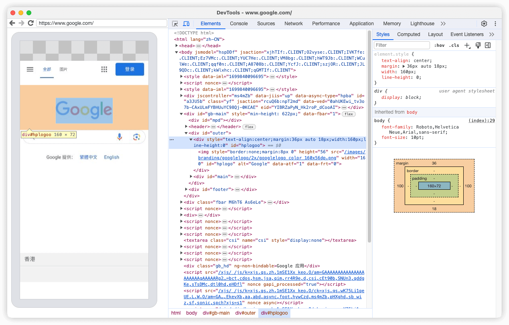

# 移动端调试

## 介绍

当移动端 web 项目部署在生产环境, 出现 Android/ios 特定设备下的样式兼容问题, 或想要模拟请求与响应数据, 以及查看 Debug 的数据内容时, 该如何进行调试?

大多数场景,你可以通过 Chrome 浏览器自带的 `chrome://inspect` 功能, 通过数据线连接设备, 进行真机调试.

但当遇到需要模拟特定请求或响应内容、注入脚本、修改请求响应头的场景时, Chrome 自带的调试工具就难以应对了. 又或者, 你的项目作为 web-view 页面嵌入在其他的应用程序内, 在这几种场景下 `whistle` 工具就可以很好的发挥了.

## 使用 <a href='chrome://inspect'>chrome://inspect</a> 调试

### 开启 USB 调试

- [Android](https://developer.android.com/studio/debug/dev-options?hl=zh-cn#Enable-debugging)

### 启用调试




## 使用 [whistle](https://wproxy.org/whistle/) 调试

### 官方介绍

> whistle(读音[ˈwɪsəl]，拼音[wēisǒu]) 基于 Node 实现的跨平台 web 调试代理工具，类似的工具有 Windows 平台上的 Fiddler，主要用于查看、修改 HTTP、HTTPS、Websocket 的请求、响应，也可以作为 HTTP 代理服务器使用，不同于 Fiddler 通过断点修改请求响应的方式，whistle 采用的是类似配置系统 hosts 的方式，一切操作都可以通过配置实现，支持域名、路径、正则表达式、通配符、通配路径等多种匹配方式，且可以通过 Node 模块扩展功能

### 安装&启动

> 步骤: 安装 [Node](https://nodejs.org/en) > 安装 whistle > 启动 whistle > 配置代理 > 安装根证书

```
# 安装
npm install -g whistle

# 检查: 执行下方命令后如果正常输出whistle帮助信息, 代表安装成功
w2 help

# 启动: 运行后默认访问地址为 http://127.0.0.1:8899/
w2 start
```

> 更多命令见 [官方文档](https://wproxy.org/whistle/options.html)

### 代理&证书配置


### 使用

### 原理&流程

### 常用规则

```
# 修改请求列表显示Style
    style://color=@fff&fontStyle=italic&bgColor=red
# 修改UserAgent
	ua://{ua}
# 修改状态码
	statusCode://[statusCode]
# 修改请求头/响应头
	reqHeaders://{value}  resHeaders://{value}
# 修改请求内容
	reqBody://{request.json}
# 修改响应内容
	resBody://{response.json}
# 模拟延时
	reqDelay://[delayTime]
# 处理跨域
	resCors://*
# 修改Host配置
	[originHost] [targetHost]

```

## 引用参考

[Whistle](https://wproxy.org/whistle/)
