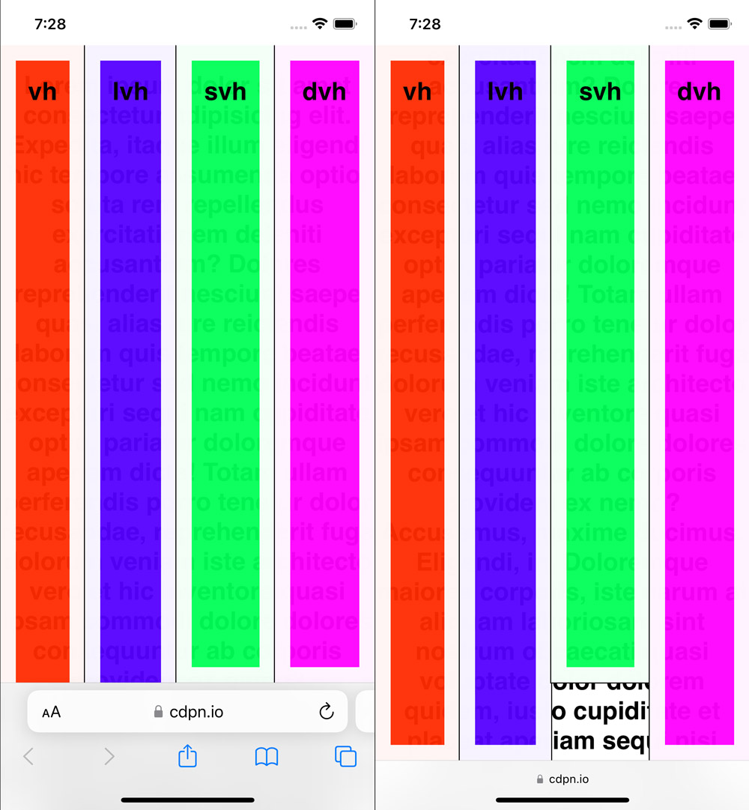

# 现代 CSS 特性

CSS 在不停迭代许多新的特性, 本文参考 [100 Days Of More Or Less Modern CSS](https://www.matuzo.at/blog/2022/100-days-of-more-or-less-modern-css/) 一起跟上现代 CSS 发展的步伐.

## 特性

### var 函数

```css
div {
  background-color: var(--not-set, #000);
}
/* 当 --not-set 未定义时, 将默认使用后备参数 */
/* Result: background-color: #000; */
```

### min & max 函数

```css
div {
  width: min(100%, 800px);
}

/* 上面的使用方法等同于下面属性的较短版本 */
div {
  width: 100%;
  max-width: 800px;
}
```

### inset 属性

inset 属性是 top 、 right 、 bottom 和 left 属性的简写。它实现与 margin 相同的多值语法。

```css
div {
  position: absolute;
  inset: auto 20px 20px auto;
}

/* 上面的使用方法等同于下面属性的较短版本 */
div {
  position: absolute;
  top: auto;
  right: 20px;
  bottom: 20px;
  left: auto;
}
```

### [CSS 逻辑属性与逻辑值](https://developer.mozilla.org/zh-CN/docs/Web/CSS/CSS_logical_properties_and_values/Basic_concepts_of_logical_properties_and_values)

逻辑属性值尊重阅读方向, 会跟随块&行的流向应用属性值.

例如属性: block-size、inline-size、margin-block、margin-inline [...](https://developer.mozilla.org/zh-CN/docs/Web/CSS/CSS_logical_properties_and_values#%E5%8F%82%E8%80%83)

TODO: Demo

### [:where](https://developer.mozilla.org/zh-CN/docs/Web/CSS/:where) & :is 伪类选择器

:where() 和 :is() 的不同之处在于，:where() 的优先级总是为 0，但是 :is() 的优先级是由它的选择器列表中优先级最高的选择器决定的。简言之他们应用的权重不一样。

```css
/* 选择标题、主要内容中的任何段落或悬停的页脚元素 */
:where(header, main, footer) p:hover {
  color: red;
  cursor: pointer;
}

/* 上面的使用方法等同于下面属性的较短版本 */
header p:hover,
main p:hover,
footer p:hover {
  color: red;
  cursor: pointer;
}
```

### :placeholder-shown 伪类选择器

:placeholder-shown 伪类选择器可以选择带有未填写的 Input 字段.

### scrollbar-gutter

在默认情况下, 如果元素在盒子内没有溢出, 则不会显示滚动条.

通过设置 scrollbar-gutter 属性为 stable, 可以始终显示滚动条的 gutter, 用以保持布局的稳定.

### dialog & :modal & ::backdrop

HTML 的 `<dialog>` 是原生的对话框元素.

可以使用 show() 和 showModal() 方法来打开 `<dialog>` 元素:

使用 `show()` 方法打开的 **对话框** 会显示在其他元素内容的上方, 用户仍然可以和下方元素进行交互.

使用`showModal()`打开的 **模式对话框**, 他的 backdrop 会覆盖其他元素, 无法与下方内容进行交互.

`:modal` 伪类选择器可以设置模式对话框方法打开的模式对话框的样式.

`::backdrop` 伪元素可以设置模式对话框或使用 [FullScreen API](https://developer.mozilla.org/zh-CN/docs/Web/API/Fullscreen_API) 置于全屏样式的元素的背景样式.

[Dialog Demo](https://codepen.io/Dnevend/pen/VwgyVNm)

### backdrop-filter

```css
backdrop-filter: blur | invert | grayscale |...;
```

backdrop-filter 属性可以将 CSS 过滤器(模糊、颜色反转、灰度等)应用到元素后面的区域.

他与 filter 属性的区别在于, backdrop-filter 不会影响到前景的文本内容.

[Demo](https://codepen.io/Dnevend/pen/xxMYMpY)

### clamp 函数

clamp() 函数定义最小值、首选值和最大值.

```css
div {
  width: clamp(300px, 90%, 700px);
}

/* 上面的使用方法等同于下面属性的较短版本 */
div {
  width: 90%;
  min-width: 300px;
  max-width: 700px;
}
```

### vh & svh & lvh & dvh

100vh 在移动设备上的问题在于它不考虑用户界面元素是否展开。它通常总是匹配大视口。
取决于用户是否与页面交互以及如何交互，他们有时会看到大视口，有时会看到小视口。将高度设置为任一单位可能不是您想要的，因为高度会动态变化。
使用 dvh 可以动态匹配 svh 或 lvh。



### aspect-ratio 属性

可以使用 aspect-ratio 属性通过定义首选宽度和高度来定义框的首选纵横比。

如果将 width 和 height 的值设置为 auto 以外的值，则 aspect-ratio 无效。

```css
div {
  /* aspect-ratio: width / height */
  aspect-ratio: 16 / 9;
  max-width: 400px;
}
```

### @container [CSS 容器查询](https://developer.mozilla.org/zh-CN/docs/Web/CSS/CSS_container_queries)

容器查询使你能够根据元素容器的大小应用样式。例如，如果容器在周围的上下文中可用的空间更少，你可以隐藏某些元素或使用较小的字体。
容器查询是媒体查询的另一种选择，后者根据视口大小或其他设备特征为元素应用样式。

[Getting started with CSS container queries](https://developer.mozilla.org/en-US/blog/getting-started-with-css-container-queries/)

### 滚动贴靠[CSS Scroll Snap](https://developer.mozilla.org/zh-CN/docs/Web/CSS/scroll-snap-type)

精心编排的滚动体验可让您的体验与众不同，滚动贴靠是匹配系统滚动用户体验的理想方式，同时提供有意义的停止点。

[CSS Scroll Snap Demo Collection](https://codepen.io/collection/KpqBGW)

## 引用参考

[Can I use](https://caniuse.com/)

[100-days-of-more-or-less-modern-css](https://www.matuzo.at/blog/2022/100-days-of-more-or-less-modern-css/)

[6-css-snippets-every-front-end-developer-should-know-in-2023](https://web.dev/articles/6-css-snippets-every-front-end-developer-should-know-in-2023?hl=zh-cn)
