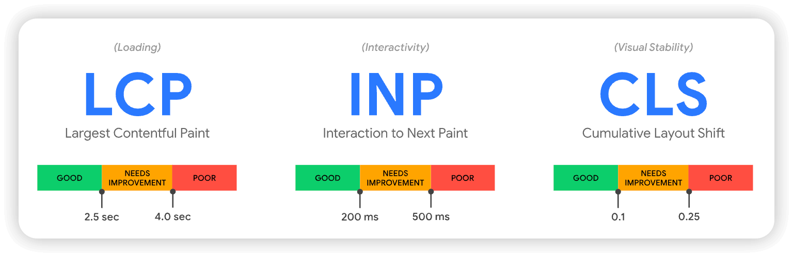

# SEO 优化

## SEO 策略

- **内容质量**关系到一篇文章在什么样的程度上能够回答用户在搜索中提出的问题。从业人员使用一个称为关键词研究的过程，以确保主题和搜索词值得追求。关键字研究包括了解搜索量、相关搜索词以及某个关键字的竞争情况。此外，作品的质量涉及到作品与用户意图的匹配程度——或帮助用户完成使他们进入该页面的任何目标。例如，一篇标题为“什么是 SEO”的文章应该专注于定义 SEO 并解释其相关组件，而一篇标题为“如何优化 SEO”的文章应该专注于可操作的建议。

- **网页因素**是指网页内容的组织方式。经过优化的网页有清晰而直接的标题、有用的章节标题、描述性的文件名和图片的 alt 标签，以及易于理解的网站层次结构。这些因素使搜索引擎很容易“理解”网页的内容。

- 与此相反，页外因素在网站本身的内容之外。最常见的页外因素之一是网站的外部链接数量。当权威（或值得信赖）的网站链接到其网站以外的内容时，Google 算法会将此视为该内容十分有价值的标志。

- **用户体验**侧重于网站访问者，[Core Web Vitals (CWV)](https://www.cloudflare.com/zh-cn/learning/performance/what-are-core-web-vitals/) 在这方面发挥了重要作用。CWV 是 Google 用来衡量网页上的项目加载速度和流畅度，并进而衡量网站用户体验的一组指标。虽然 CWV 对任何网站都很重要，但对某些行业可能特别关键，如电子商务。例如，当有人试图在一家在线鞋店结账时，缓慢的页面速度可能意味着 100 美元收入和 0 美元之间的区别。

## 什么是 Core Web Vitals（CWV）？

Core Web Vitals (CWV) 是一组（包含三个）Web 性能指标。Google 的搜索引擎会衡量这三个指标，并在决定将哪些页面显示在搜索结果中时考虑这些指标。这意味着搜索引擎优化 (SEO) 从业者应优化其网页的 core web vitals，作为提高这些网页排名的整体策略的一部分。

CWV 包括：

1. 最大内容绘制 (LCP - Largest Contentful Paint)，衡量加载速度

   最大内容绘制测量加载网页的最大部分（通常是图像或文本块）所需的时间。
   根据 Google 的指导方针，低于 2.5 秒即将 LCP 的测量值归类为“良好”。然而，更快总是更好。

2. 首次输入延迟 (FID - First Input Delay)，用于衡量页面交互性

   首次输入延迟用于衡量用户第一次尝试与网页交互以及网页做出响应之间的时间。换句话说，FID 量化了一个人第一次点击屏幕并使某事发生的速度。根据 Google 的指导方针，“良好”的 FID 为 100 毫秒或更短。

3. 累计布局偏移 (CLS - Cumulative Layout Shift)，用于衡量视觉稳定性

   CLS 测量网页在加载时“跳跃”的程度。具体来说，它测量页面布局中最大的“突发”偏移。根据 Google 的指导方针，“良好”的 CLS 测量值等于或小于 0.1。

### 如何衡量 Core Web Vitals?

有许多工具可用于检查 CWV。以下是 Google 直接提供的所有产品：

- [Chrome UX 报告 (CrUX) ](https://developer.chrome.com/docs/crux?hl=zh-cn)提供 Chrome 用户报告的现场数据，为网站所有者提供有关实际用户网站体验的数据。

- [Google Lighthouse](https://developer.chrome.com/docs/lighthouse/overview?hl=zh-cn) 是一款免费工具，可提供有关 CWV 的实验室指标。它为提高性能、SEO、可访问性等提供了可行的见解。

- [Google PageSpeed Insights](https://pagespeed.web.dev/) 结合了 CrUX 和 Lighthouse 的功能，提供有关 CWV 和其他 Web Vitals 的现场和实验室数据。用户可以使用 PageSpeed Insights 检查任意网站的性能，无论该网站是否归他们所有。以下是 PageSpeed Insights 报告的示例。

- [Google Search Console](https://search.google.com/search-console/about) 部分基于 CrUX 现场数据，并通过 URL 或 URL 组提供 CWV 性能数据。

### 如何改善 Core Web Vitals?

#### 如何改善 LCP

- 使用内容交付网络 (CDN)：CDN 将内容缓存在世界各地，以便内容更快地到达用户处。

- 优化图像：图像通常是页面的最大元素。缩减图像文件大小有助于加快图像的加载时间。

- 实施延迟加载：在延迟加载中，网站资源仅在用户需要时才加载。这使得网站加载效率更高，但研究表明，过度使用此功能可能会导致较低的 LCP。出于这个原因，Google 建议将延迟加载图像限制在“非首屏”或用户必须滚动才能看到的网页部分。

#### 如何改进 FID

- 缩减 JavaScript 函数的大小：代码繁重的动态网页可能会导致输入延迟，因为浏览器必须等待所有代码加载后才能执行。JavaScript 极简化有助于加快此过程。

- 构建静态网页：静态 HTML 网页的加载速度比动态网页快得多，当通过 CDN 分发时尤为如此。了解[静态站点生成器](https://www.cloudflare.com/zh-cn/learning/performance/static-site-generator/)或 [Jamstack](https://www.cloudflare.com/zh-cn/learning/performance/what-is-jamstack/)，这是一种强调静态内容的开发理念。

- 删除不必要的第三方工具和脚本：在您的网站上加载其他工具也会降低性能。减少网站上第三方工具的数量通常可以提高 FID 和网站速度。

#### 如何改善 CLS

- **最小化第三方页面元素**：与页面的其余部分相比，页面上的第三方元素从不同的位置加载。因此，它们可能会在稍微不同的时间加载，从而在加载时更改页面的布局。最大限度地减少这些第三方元素的使用会减少由此产生的布局偏移的数量。

- **为嵌入内容保留空间**：许多第三方元素（例如广告）对于网站的功能或业务模式至关重要，并且无法消除。开发人员可以在浏览器获取实际元素之前在网页上为这些元素保留空间以加载。

- **确保以最佳尺寸加载图像**：这与一般优化图像的过程略有不同。台式电脑、平板电脑和智能手机都需要尺寸略有不同的图像，因为它们的屏幕尺寸各不相同。如果浏览器首先加载大的、桌面优化的图像，然后因为使用的是智能手机而需要获取移动优化的图像，这可能会导致页面上的内容在加载不同大小的图像时跳转。

- **包括图像和视频的高度和宽度**：高度和宽度属性告诉浏览器图像将有多大，以便他们可以在图像或视频加载之前保留该空间。

- **使用 CSS 纵横比框**：开发人员可以使用许多 CSS 技术来利用纵横比为页面元素保留空间——在这里了解更多信息。

## 其他前端 SEO 优化措施

- 使用 CSS 图标，背景图片压缩，使用雪碧图，减少 HTTP 请求数等。
- 结构、表现和行为的分离：尽量不要把 CSS 和 JS 放在同一个页面，采用外链的方式。
- 优化网站分级结构，调整页面布局。在每个内页加面包屑导航，页面内容尽量不要做成 flash、视频。
- 集中网站权重，可以使用"rel=nofollown"属性，告诉爬虫无需抓取此页，从而将权重分绐其他的链接。
- strong、em 标签强调关键字。strong 标签在搜索引擎中能够得到高度的重视。
- 利用 a 标签的 title 属性。在不影响页面功能的情况下，尽量绐 a 标签加上 title 属性，更有利于爬虫抓取信息。
- img 应使用"alt"属性加以说明，这个属性可以在图片加载不出来的时候显示在页面上相关的文字信息。
- 精心设置 meta 标签，如 title，keywords，description 等，反映网站的定位。内容与关键字要对应，增加关键字的密度。
- 增加网站的 404 页面，利于提高用户体验，主要防止爬虫丟失。
- 重要内容不要用 JS 输出，爬虫不识别 JS 代码里的程序内容。
- 尽量少使用 iframe 框架，爬虫一般不会读取其中的内容。
- 添加外链。选择与网站相关性比较高，整体质量比较好的网站交换友链，巩固稳定关键词排名。
- 填充优质的原创内容。

## 如何分析

- 首先可以利用 webpack 打包分析工具，资源包分析，开发体验优化。
- 其次可以使用 `network`，`Performance` 等在本地进行测量，根据 `Lighthouse` 报告给出的一些建议进行优化。
- 发布之后，可以使用 [`PageSpeed Insights`](https://pagespeed.web.dev/) 去看下线上的性能情况。
- 接着，可以使用 [`Chrome User Experience Report API`](https://developer.chrome.com/docs/crux) 去捞取线上过去 28 天的数据。
- 发现数据有异常，可以使用 `DevTools` 工具进行具体代码定位分析。
- 使用 [`Search Console’s Core Web Vitals report`](https://search.google.com/search-console/core-web-vitals) 查看网站功能整体情况。
- 使用 [`Web Vitals 扩展`](https://chromewebstore.google.com/detail/web-vitals/ahfhijdlegdabablpippeagghigmibma)方便的看页面核心指标情况。
- 使用前端监控平台查看线上运行性能指标，全链路优化。

## 参考引用

- [SEO 优化措施](https://jonny-wei.github.io/blog/devops/performance/code.html#seo-%E4%BC%98%E5%8C%96%E6%8E%AA%E6%96%BD)

- [网站速度如何促进搜索引擎优化 (SEO)？ - CloudFlare](https://www.cloudflare.com/zh-cn/learning/performance/how-website-speed-boosts-seo/)

- [Web Vitals](https://web.dev/articles/vitals?hl=zh-cn)

- [指标性能优化](https://jonny-wei.github.io/blog/devops/performance/optimization.html) 🌟

- [性能指标与采集](https://jonny-wei.github.io/blog/devops/performance/indicator.html)
