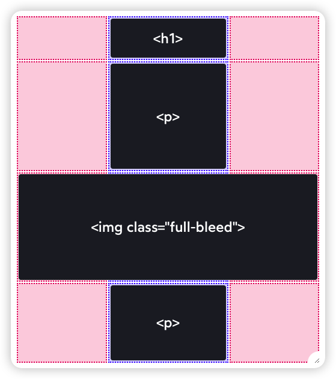

# 2024

## 2024-07

- [Exposition of Frontend Build Systems - 前端构建系统解析](https://sunsetglow.net/posts/frontend-build-systems.html)

- [Write For Others But Mostly For Yourself](https://jack-vanlightly.com/blog/2022/1/25/write-for-others-but-mostly-for-yourself)

- [Flow Charts with CSS Anchor Positioning](https://coryrylan.com/blog/flow-charts-with-css-anchor-positioning)

## 2024-06

### 06-23

- [最大可提取价值 (MEV)](https://ethereum.org/zh/developers/docs/mev/)
- [The 0 to 1 Guide for MEV](https://calblockchain.mirror.xyz/c56CHOu-Wow_50qPp2Wlg0rhUvdz1HLbGSUWlB_KX9o)

### 06-18

- [《写给程序员的 UI 设计书》](https://shukebeta.gitbook.io/uid4programmer_chineseedition)
- [Web 前端写给 Web 设计师的注意事项](https://github.com/nimoc/web-design-notes)

### 06-03

- [Lottie (file format)](<https://en.wikipedia.org/wiki/Lottie_(file_format)>)
  Lottie 是一种矢量图形动画文件格式，以德国剪影动画先驱 Charlotte "Lotte" Reiniger 命名。
  Lottie 基于 JSON，但 Lottie 文件使用长度为 1-2 个字符的密钥，并且人类无法读取。它旨在作为动画 GIF 和 APNG 文件的更轻量级替代品，用于 Web、移动和桌面应用程序。作为矢量，它与设备分辨率无关。它还可以包括光栅图形元素。它还允许包含交互元素。

- [Telegram Stickers](https://core.telegram.org/api/stickers)
- [Lottie-web](https://github.com/Easterok/telegram-onboarding-kit/blob/main/packages/telegram-ui/components/Sticker/README.md)
  Lottie is a mobile library for Web that parses Adobe After Effects animations exported as json with Bodymovin and renders them natively!

- [lottie-player](https://github.com/LottieFiles/lottie-player)

## 2024-05

### 05-23

- [TMA 示例](https://docs.ton.org/mandarin/develop/dapps/telegram-apps/app-examples)
  了解如何创建 Telegram 小程序
- Ton Mini App Demo
  - [demo-dapp-with-react-ui](https://github.com/ton-connect/demo-dapp-with-react-ui)
  - [vite-boilerplate](https://github.com/telegram-mini-apps-dev/vite-boilerplate)
  - [reactjs-template](https://github.com/Telegram-Mini-Apps/reactjs-template)
  - [twa-template](https://github.com/ton-community/twa-template)

### 05-21

- [Remixing React Router ](https://remix.run/blog/remixing-react-router)

  
  Coupling data fetching to components leads to render+fetch chains

  
  Route fetching parallelizes requests, eliminating slow render+fetch chains

### 05-15

- [How I made my GitHub profile README dynamic](https://tduyng.github.io/blog/dynamic-github-profile-readme/)

### 05-14

- [DePIN 科普文：IoTeX、DePHY 和 peaq 等基础设施是怎么运转的](https://mp.weixin.qq.com/s/-7JJjXlycdFfkTYoeWPMBw)

### 05-10

- [Why React Query?](https://ui.dev/why-react-query)

### 05-09

- [Windows 设计史（一）：从青涩到成熟（Windows 1.0—95）](https://mp.weixin.qq.com/s/_e9Bp5twKfOXYuqhwKuVQg)[🔗 少数派](https://sspai.com/post/87835)

- 搭建 Monorepo 项目
  - [为什么 pnpm+monorepo 是组件库项目的最佳实践](https://juejin.cn/post/7316409548994625574)
  - [React + Pnpm + Vite 搭建 Monorepo 低代码项目](https://juejin.cn/post/7253764065305346108)
  - [React Monorepo Setup Tutorial with pnpm and Vite: React project + UI, Utils](https://dev.to/lico/react-monorepo-setup-tutorial-with-pnpm-and-vite-react-project-ui-utils-5705)
  - [Setting up a React (Vite) Monorepo project with Yarn Workspaces](https://adeesh.hashnode.dev/react-vite-monorepo-setup)
  - [Monorepo Setup with Nx , Nextjs & Shadcn-UI](https://medium.com/readytowork-org/monorepo-setup-with-nx-nextjs-and-shadcn-ui-3b72c3599470)
  - [Sharing your Tailwind Configuration between Monorepo Packages](https://dev.to/bdbch/sharing-your-tailwind-configuration-between-monorepo-packages-4o5k)

### 05-07

- [Everyone can now run JavaScript on Cloudflare with Workers](https://blog.cloudflare.com/cloudflare-workers-unleashed/)

  > Cloudflare Workers 的名称源自 Web Workers，更具体地说，Service Workers 是 W3C 标准 API，用于在 Web 浏览器后台运行并拦截 HTTP 请求的脚本。 Cloudflare Workers 是根据相同的标准 API 编写的，但在 Cloudflare 的服务器上运行，而不是在浏览器中运行。

  > 当您部署 Worker 时，它会在 30 秒内部署到全球一百多个地点的 Cloudflare 整个边缘网络。对您的域的每个请求都将由您的工作人员在靠近最终用户的 Cloudflare 位置进行处理，而无需您考虑各个位置。我们上线的地点越多，您的代码就越“到处运行”。

  Here are the tools you get to work with:

  - 使用最新的标准语言功能执行任何 JavaScript 代码。
  - 拦截并修改 HTTP 请求和响应 URL、状态、标头和正文内容。
  - 直接回复您的 Worker 的请求，或将其转发到其他地方。
  - 向第三方服务器发送 HTTP 请求。
  - 串行或并行发送多个请求，并使用响应来组成对原始请求的最终响应。
  - 在响应返回到客户端后发送异步请求（例如，用于日志记录或分析）。
  - 控制其他 Cloudflare 功能，例如缓存行为。

### 05-06

- [使用 Cloudflare Worker 代理 Google 站点](https://xiaowangye.org/posts/using-cloudflare-worker-proxy-google/)
- [使用 Cloudflare Workers 自建节点科学上网](https://xiaowangye.org/posts/using-cloudflare-workers-build-proxy-for-internet-access/)

## 2024-04

### 04-26

- [Full-Bleed Layout Using CSS Grid](https://www.joshwcomeau.com/css/full-bleed/)

  讲解使用 CSS 网格（grid）实现页面的出血布局（即图片占用边距，占满整个行宽）。
  

### 04-24

- [吊打公有云的赛博佛祖 Cloudflare](https://mp.weixin.qq.com/s/i4wk9ebyUK7irNSwuT3NWQ)
- [赛博菩萨 Cloudflare 圆桌访谈与问答录](https://mp.weixin.qq.com/s/jU418HAlObe1nWgzEsLrJQ)

  重点：流量免费成本效益高、易用操作简单、服务体量大、主打安全、良心服务、对个人站长和小微企业友好。
  使用：使用过 CF 的自动 HTTPS 重定向功能，操作和体验挺好。
  AI 总结：
  Cloudflare 是一家内容交付网络（CDN）和云服务提供商，提供安全、DDoS 防护和无服务器计算等一系列功能。与传统的公共云提供商相比，Cloudflare 通过其免费计划、简单的网站部署和无服务器功能，为开发者提供更好的体验。Cloudflare 的服务如 R2 对象存储和 D1 数据库也非常具有成本效益，没有数据传输费用。文章认为，Cloudflare 在提供可靠的在线访问方面的能力甚至超过了传统的公共云，使其成为小型和大型企业都吸引的替代选择。总的来说，Cloudflare 被定位为可以胜过传统公共云提供商的“网络佛陀”。

### 04-22

- [TON 技术文档链接](https://docs.google.com/document/d/1aJtWRSI1PL1NtTEnViJUVTR1raTZwG_zrOPIcv9UMPc/mobilebasic)

- [TON 开发介绍&链接](https://docs.google.com/document/d/1SMeBBug6B10nNo70_BofftYBtwywfQXUzRSwE1lo4Gk/mobilebasic)

  机器人制作流程、BOT&TWA（Telegram Web App）、常用游戏 API、常用机器人链接、开发者工具

- [TON 生态 - Github](https://github.com/ton-society/ecosystem-map)

- [TON 资助计划](https://github.com/ton-society/grants-and-bounties/blob/main/grants/GRANT_PROGRAM_GUIDELINES.md)

### 04-14

- [分置区块与状态存储，优化节点性能](https://www.btcstudy.org/2024/03/29/separately-store-blocks-and-state-to-improve-node-performance/)

  通过将比特币全节点的`区块数据`和`状态数据`通过软连接的方式分别存储，降低存储成本，优化节点性能。

## 2024-02

### 02-26

- [Web 终极拦截技巧](https://hughfenghen.github.io/posts/2023/12/23/web-spy/)

### 02-22

- [2024 年 React 趋势](https://sorrycc.com/react-trend-2024/)

### 02-02

- [我知道你想用 useEffect，但你先别急](https://mp.weixin.qq.com/s/i1S1IJzJ1kocMy1ouxtJyw)

  该文档讨论了在 React 组件中使用 useEffect 钩子的最佳实践。它提供了使用和避免 useEffect 的常见情况的示例，如获取数据、缓存计算、在属性更改时重置状态以及在事件处理程序之间同步逻辑。具体而言，它建议在渲染过程中计算值，而不是将它们存储在状态中（如果可能的话），并且在事件处理程序中处理事件逻辑，而不是在 effect 中处理。有趣的一点是，** effect 通常只用于与 API 或浏览器等外部系统同步，而不用于基于其他状态值的内部状态更新 **。如果仅用于内部状态更改，effect 会引入不必要的重新渲染。

  **以下情况可能考虑不要使用 useEffect**

  - 如果你可以在渲染期间计算某些内容，则不需要使用 Effect。

  - 想要缓存昂贵的计算，请使用 useMemo 而不是 useEffect。

  - 想要重置整个组件树的 state，请传入不同的 key。

  - 想要在 prop 变化时重置某些特定的 state，请在渲染期间处理。

  - 组件 显示 时就需要执行的代码应该放在 Effect 中，否则应该放在事件处理函数中。

  - 如果你需要更新多个组件的 state，最好在单个事件处理函数中处理。

  - 当你尝试在不同组件中同步 state 变量时，请考虑状态提升。

  - 你可以使用 Effect 获取数据，但你需要实现清除逻辑以避免竞态条件。

## 2024-01

### 01-09

- [王川：论数量就是质量](https://mp.weixin.qq.com/s/VLT3XdejNNazi-xS7XMS0A)

  > 产品沉思录 Vol.20240108 观点：数量 > 质量

  - 很多人觉得投资太难，那是因为经历和吃亏太少，经过几个牛熊周期，犯完一百个错误，很多问题就弄通了。

  - 很多人觉得赚得不够多，是自己工作不勤奋，但实际问题是对外连接太少，无法发生大规模价值交换。

  - 常有人哀叹世态炎凉，遇人不淑，本质上还是接触人太少了，因此没得选。

  - 错误地以为瓶颈在于质量，幻想在不增加数量的前提下，用某种奇技淫巧，偷工减料达到目的。

  - 数量不够，底子不厚，很多事情是做不到的。即使有时有捷径，因为缺乏数量和后劲，欠的帐迟早是要还的。

  ……

- [ChatGPT-Next-Web 使用的技术栈](https://twitter.com/mortiest_ricky/status/1744654109087813976)

  - 框架: @nextjs
  - UI 库: Arco Design
  - ORM: @prisma
  - KV: @upstash Redis
  - DB: @supabase PgSQL
  - CI/CD: @vercel
  - Project: @github
  - Mail: @resend
  - Auth: @nextauthjs
  - Logs & UpTime: @BetterStackHQ
  - 支付: @lmsqueezy + 蓝兔支付（国内）
  - 域名: 腾讯云

  > 全部选用了 Serverless 方案，而不是搞个云服务器自部署，这样的做法有诸多优点以及不可忽视的缺陷。

  **优点：**

  - 免去运维烦恼，不需要担心服务器被黑、峰值扩容、数据备份等问题，服务商会抵御这些风险
  - 网站刚起步时可以直接白嫖免费额度，当用户量大的时候，一般盈利也足以支付费用了 (7/n)

  **缺点:**

  - 数据库操作全都要走外网，导致系统延迟较高，这一点对 API 服务比较致命，免费的云实例吞吐量也不够，vercel edge function 10s 自动超时配合云数据库拉跨的并发限制，我花了好几个晚上来优化这两个卧龙凤雏
  - 普通账户 SLA 不太靠谱，遇到过好几次 Vercel 挂掉导致服务中断

### 01-05

- [2023 JavaScript Rising Stars](https://risingstars.js.org/2023/en)

  每年年初，Michael 都会汇总上一年在 GitHub 上最受欢迎的项目。 排名第一的是 React 组件的 shadcn/ui 套件，但也有很多新鲜的条目。
