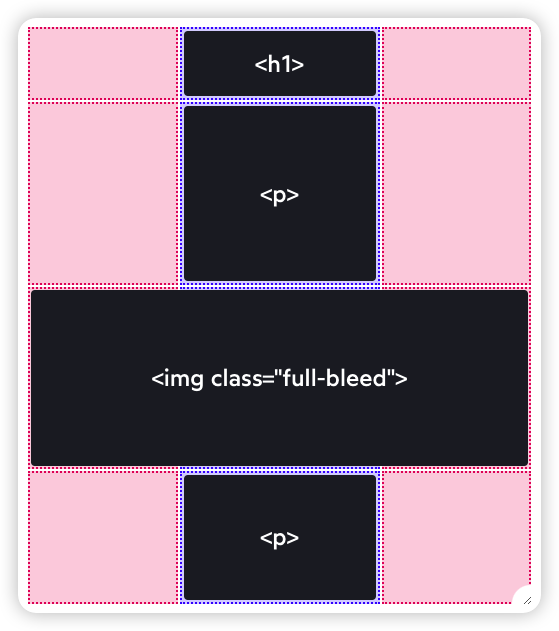

# 2024

## 2024-10

- [How to Build an Image Search Application With OpenAI CLIP & PostgreSQL in JavaScript](https://www.timescale.com/blog/how-to-build-an-image-search-application-with-openai-clip-postgresql-in-javascript/)

- [Server Setup Basics](https://becomesovran.com/blog/server-setup-basics.html)

## 2024-09

- [好的重构与坏的重构](https://www.builder.io/blog/good-vs-bad-refactoring)

  1、渐进式：进行小的、可管理的更改，而不是彻底重写。

  2、在进行重大重构或新抽象之前深入理解代码。

  3、匹配现有的代码风格：一致性是可维护性的关键。

  4、避免太多新的抽象：保持简单，除非真正保证复杂性。

  5、避免在没有团队支持的情况下添加新的库，尤其是具有非常不同的编程风格的库。

  6、在重构之前编写测试并随时更新它们。这可确保您保持原始功能。

- [Tenten 的技術堆疊 (Tenten’s Dev Stacks)](https://tenten.co/insight/dev/tenten-dev-stacks/)

- 谷歌 SEO 优化

  - [谷歌 SEO 优化第一步之关键词研究 - 筛选高搜索量低竞争度关键词行之有效的方法](https://liusha.com/keyword-tools/)
  - [谷歌 SEO 优化第二步之内容写作 - 怎么写出高价值的内容](https://liusha.com/content-write/)
  - [谷歌 SEO 优化第三步之外链建设](https://liusha.com/backlinks/)
  - [Sitemap 網站地圖是什麼？對 SEO 有幫助嗎？](https://www.yesharris.com/seo-basic/sitemap-seo/)
  - [SEO 检查清单](https://university.tenten.co/t/seo/1341)

- [.DS_Store 文件的起源](https://www.arno.org/on-the-origins-of-ds-store)

## 2024-08

- [IPFS 分布式存储协议分析与思考](https://guide.pseudoyu.com/zh/docs/ipfs/blockchain_ipfs_structure/)

- [Philip Roberts: What the heck is the event loop anyway?](https://2014.jsconf.eu/speakers/philip-roberts-what-the-heck-is-the-event-loop-anyway.html)

- [Uniswap 简史](https://web3caff.com/zh/archives/41255)

- [Being on The Semantic Web is easy, and, frankly, well worth the bother](https://csvbase.com/blog/13)
- [The semantic web is now widely adopted](https://news.ycombinator.com/item?id=41307011)

  语义网（Semantic Web）的现状

- [Calling All Hackers](https://phrack.org/issues/71/17.html#article) 🌟
- [Calling All Hackers - Hacker News](https://news.ycombinator.com/item?id=41306128)

  探讨了黑客文化与商业之间的关系，以及在现代金融环境中如何理解和利用这些知识。

- Small Web

  - [Kagi Small Web - Github](https://github.com/kagisearch/smallweb)
  - [The small web is beautiful](https://benhoyt.com/writings/the-small-web-is-beautiful/) 🌟
  - [Rediscovering the Small Web](https://neustadt.fr/essays/the-small-web/)

- [MegaEase 的远程工作文化](https://coolshell.cn/articles/20765.html)

- [TON Ecosystem Panorama and Security Report 2024](https://tonbit.xyz/reports-page)

  2024 年 TON 生态系统全景和安全报告

- [Examples of Great URL Design](https://blog.jim-nielsen.com/2023/examples-of-great-urls/)
- [Four Cool URLs](https://alexpounds.com/blog/2018/12/29/four-cool-urls)

  好的 URL 应该具有描述性，对于技术产品来说，无需看到用户界面即可浏览网站的能力是一种很酷的能力。

- [向量搜索的探索](https://blog.shalvah.me/posts/an-exploration-of-vector-search)

  人工智能领域如何将文本转换为向量进行搜索。

- IndieWeb

  > IndieWeb 是一个由个人网站组成的社区。这个社区由一系列简单的标准互联，并建设在拥有自己的域名、使用域名作为主要身份辨识手段、在自己的站点上发布内容（也可同步到其他服务上）、掌控自己的数据等原则上。

  - [IndieWeb](https://indieweb.org/Main_Page-zh)
  - [IndieWeb - Webmention](https://indieweb.org/Webmention)
  - [Now, I'm in IndieWeb?](https://www.owenyoung.com/en/blog/indieweb/)

  - 在网络上发布内容时，它应当属于你，而非某家公司。太多企业已倒闭，导致用户数据全部丢失。通过加入 IndieWeb，你的内容将始终归你所有，并受你掌控。
  - 你的文章和状态更新可以被散布到任何服务上，而不用受到某一平台的限制，这使你能够和所有人进行互动。而其他平台上的回复与点赞也可以回流到你的站点上。
  - 你可以发布任何你想发布的内容，以任何你想要的格式，且无人监控。此外，你分享的是简洁易读的链接，如 example.com/ideas。这些链接永久有效，始终可用。

- 去中心化网络平台（Web5）

  - [WEB5: A DECENTRALIZED WEB PLATFORM](https://developer.tbd.website/projects/web5/)
  - [First impressions of Web5](https://educatedguesswork.org/posts/web5-first-impressions/)
  - [Challenges in Building a Decentralized Web](https://educatedguesswork.org/posts/challenges-web-decentralization/)

  > 这是一个"更加去中心化的网络平台",旨在在与网络服务交互时增强用户对身份和数据的控制。与之前的去中心化网络概念不同,Web5 专注于使用户能够在不依赖集中式服务的情况下,跨多个应用管理自己的身份和数据。其核心思想围绕着去中心化网络节点(DWN),用户在这里存储自己的数据,允许服务请求访问,而不是服务自己持有数据。

  > DWN 的数据模型仍然不够完善,缺乏健全的访问控制和冲突解决机制。此外,分布式网络应用(DWA)的概念被引入,作为渐进式网络应用的一种演化,但技术细节仍然模糊。互操作性是一个重大挑战,因为不同的服务必须就数据格式和语义达成一致,才能有效共享信息。

## 2024-07

- [Exposition of Frontend Build Systems - 前端构建系统解析](https://sunsetglow.net/posts/frontend-build-systems.html)

- [Write For Others But Mostly For Yourself](https://jack-vanlightly.com/blog/2022/1/25/write-for-others-but-mostly-for-yourself) 🌟

- [Flow Charts with CSS Anchor Positioning](https://coryrylan.com/blog/flow-charts-with-css-anchor-positioning)

## 2024-06

- [最大可提取价值 (MEV)](https://ethereum.org/zh/developers/docs/mev/)
- [The 0 to 1 Guide for MEV](https://calblockchain.mirror.xyz/c56CHOu-Wow_50qPp2Wlg0rhUvdz1HLbGSUWlB_KX9o)

- [《写给程序员的 UI 设计书》](https://shukebeta.gitbook.io/uid4programmer_chineseedition)
- [Web 前端写给 Web 设计师的注意事项](https://github.com/nimoc/web-design-notes)

- Lottie

  - [Lottie (file format)](<https://en.wikipedia.org/wiki/Lottie_(file_format)>)
    Lottie 是一种矢量图形动画文件格式，以德国剪影动画先驱 Charlotte "Lotte" Reiniger 命名。
    Lottie 基于 JSON，但 Lottie 文件使用长度为 1-2 个字符的密钥，并且人类无法读取。它旨在作为动画 GIF 和 APNG 文件的更轻量级替代品，用于 Web、移动和桌面应用程序。作为矢量，它与设备分辨率无关。它还可以包括光栅图形元素。它还允许包含交互元素。

  - [Telegram Stickers](https://core.telegram.org/api/stickers)
  - [Lottie-web](https://github.com/Easterok/telegram-onboarding-kit/blob/main/packages/telegram-ui/components/Sticker/README.md)
    Lottie is a mobile library for Web that parses Adobe After Effects animations exported as json with Bodymovin and renders them natively!

  - [lottie-player](https://github.com/LottieFiles/lottie-player)

## 2024-05

- [TMA 示例](https://docs.ton.org/mandarin/develop/dapps/telegram-apps/app-examples) 了解如何创建 Telegram 小程序

  - [demo-dapp-with-react-ui](https://github.com/ton-connect/demo-dapp-with-react-ui)
  - [vite-boilerplate](https://github.com/telegram-mini-apps-dev/vite-boilerplate)
  - [reactjs-template](https://github.com/Telegram-Mini-Apps/reactjs-template)
  - [twa-template](https://github.com/ton-community/twa-template)

- [Remixing React Router ](https://remix.run/blog/remixing-react-router)

  
  Coupling data fetching to components leads to render+fetch chains

  
  Route fetching parallelizes requests, eliminating slow render+fetch chains

- [How I made my GitHub profile README dynamic](https://tduyng.github.io/blog/dynamic-github-profile-readme/)

- [DePIN 科普文：IoTeX、DePHY 和 peaq 等基础设施是怎么运转的](https://mp.weixin.qq.com/s/-7JJjXlycdFfkTYoeWPMBw)

- [Why React Query?](https://ui.dev/why-react-query)

- [Windows 设计史（一）：从青涩到成熟（Windows 1.0—95）](https://mp.weixin.qq.com/s/_e9Bp5twKfOXYuqhwKuVQg)[🔗 少数派](https://sspai.com/post/87835)

- 搭建 Monorepo 项目

  - [为什么 pnpm+monorepo 是组件库项目的最佳实践](https://juejin.cn/post/7316409548994625574)
  - [React + Pnpm + Vite 搭建 Monorepo 低代码项目](https://juejin.cn/post/7253764065305346108)
  - [React Monorepo Setup Tutorial with pnpm and Vite: React project + UI, Utils](https://dev.to/lico/react-monorepo-setup-tutorial-with-pnpm-and-vite-react-project-ui-utils-5705)
  - [Setting up a React (Vite) Monorepo project with Yarn Workspaces](https://adeesh.hashnode.dev/react-vite-monorepo-setup)
  - [Monorepo Setup with Nx , Nextjs & Shadcn-UI](https://medium.com/readytowork-org/monorepo-setup-with-nx-nextjs-and-shadcn-ui-3b72c3599470)
  - [Sharing your Tailwind Configuration between Monorepo Packages](https://dev.to/bdbch/sharing-your-tailwind-configuration-between-monorepo-packages-4o5k)

- [Everyone can now run JavaScript on Cloudflare with Workers](https://blog.cloudflare.com/cloudflare-workers-unleashed/)

  > Cloudflare Workers 的名称源自 Web Workers，更具体地说，Service Workers 是 W3C 标准 API，用于在 Web 浏览器后台运行并拦截 HTTP 请求的脚本。 Cloudflare Workers 是根据相同的标准 API 编写的，但在 Cloudflare 的服务器上运行，而不是在浏览器中运行。

  > 当您部署 Worker 时，它会在 30 秒内部署到全球一百多个地点的 Cloudflare 整个边缘网络。对您的域的每个请求都将由您的工作人员在靠近最终用户的 Cloudflare 位置进行处理，而无需您考虑各个位置。我们上线的地点越多，您的代码就越“到处运行”。

  Here are the tools you get to work with:

  - 使用最新的标准语言功能执行任何 JavaScript 代码。
  - 拦截并修改 HTTP 请求和响应 URL、状态、标头和正文内容。
  - 直接回复您的 Worker 的请求，或将其转发到其他地方。
  - 向第三方服务器发送 HTTP 请求。
  - 串行或并行发送多个请求，并使用响应来组成对原始请求的最终响应。
  - 在响应返回到客户端后发送异步请求（例如，用于日志记录或分析）。
  - 控制其他 Cloudflare 功能，例如缓存行为。

- [使用 Cloudflare Worker 代理 Google 站点](https://xiaowangye.org/posts/using-cloudflare-worker-proxy-google/)
- [使用 Cloudflare Workers 自建节点科学上网](https://xiaowangye.org/posts/using-cloudflare-workers-build-proxy-for-internet-access/)

## 2024-04

- [Full-Bleed Layout Using CSS Grid](https://www.joshwcomeau.com/css/full-bleed/)

  讲解使用 CSS 网格（grid）实现页面的出血布局（即图片占用边距，占满整个行宽）。
  

- [吊打公有云的赛博佛祖 Cloudflare](https://mp.weixin.qq.com/s/i4wk9ebyUK7irNSwuT3NWQ)
- [赛博菩萨 Cloudflare 圆桌访谈与问答录](https://mp.weixin.qq.com/s/jU418HAlObe1nWgzEsLrJQ)

  重点：流量免费成本效益高、易用操作简单、服务体量大、主打安全、良心服务、对个人站长和小微企业友好。
  使用：使用过 CF 的自动 HTTPS 重定向功能，操作和体验挺好。
  AI 总结：
  Cloudflare 是一家内容交付网络（CDN）和云服务提供商，提供安全、DDoS 防护和无服务器计算等一系列功能。与传统的公共云提供商相比，Cloudflare 通过其免费计划、简单的网站部署和无服务器功能，为开发者提供更好的体验。Cloudflare 的服务如 R2 对象存储和 D1 数据库也非常具有成本效益，没有数据传输费用。文章认为，Cloudflare 在提供可靠的在线访问方面的能力甚至超过了传统的公共云，使其成为小型和大型企业都吸引的替代选择。总的来说，Cloudflare 被定位为可以胜过传统公共云提供商的“网络佛陀”。

- TON

  - [TON 技术文档链接](https://docs.google.com/document/d/1aJtWRSI1PL1NtTEnViJUVTR1raTZwG_zrOPIcv9UMPc/mobilebasic)

  - [TON 开发介绍&链接](https://docs.google.com/document/d/1SMeBBug6B10nNo70_BofftYBtwywfQXUzRSwE1lo4Gk/mobilebasic)

    机器人制作流程、BOT&TWA（Telegram Web App）、常用游戏 API、常用机器人链接、开发者工具

  - [TON 生态 - Github](https://github.com/ton-society/ecosystem-map)

  - [TON 资助计划](https://github.com/ton-society/grants-and-bounties/blob/main/grants/GRANT_PROGRAM_GUIDELINES.md)

- [分置区块与状态存储，优化节点性能](https://www.btcstudy.org/2024/03/29/separately-store-blocks-and-state-to-improve-node-performance/)

  通过将比特币全节点的`区块数据`和`状态数据`通过软连接的方式分别存储，降低存储成本，优化节点性能。

## 2024-02

- [Web 终极拦截技巧](https://hughfenghen.github.io/posts/2023/12/23/web-spy/)

- [2024 年 React 趋势](https://sorrycc.com/react-trend-2024/)

- [我知道你想用 useEffect，但你先别急](https://mp.weixin.qq.com/s/i1S1IJzJ1kocMy1ouxtJyw)

  该文档讨论了在 React 组件中使用 useEffect 钩子的最佳实践。它提供了使用和避免 useEffect 的常见情况的示例，如获取数据、缓存计算、在属性更改时重置状态以及在事件处理程序之间同步逻辑。具体而言，它建议在渲染过程中计算值，而不是将它们存储在状态中（如果可能的话），并且在事件处理程序中处理事件逻辑，而不是在 effect 中处理。有趣的一点是，** effect 通常只用于与 API 或浏览器等外部系统同步，而不用于基于其他状态值的内部状态更新 **。如果仅用于内部状态更改，effect 会引入不必要的重新渲染。

  **以下情况可能考虑不要使用 useEffect**

  - 如果你可以在渲染期间计算某些内容，则不需要使用 Effect。

  - 想要缓存昂贵的计算，请使用 useMemo 而不是 useEffect。

  - 想要重置整个组件树的 state，请传入不同的 key。

  - 想要在 prop 变化时重置某些特定的 state，请在渲染期间处理。

  - 组件 显示 时就需要执行的代码应该放在 Effect 中，否则应该放在事件处理函数中。

  - 如果你需要更新多个组件的 state，最好在单个事件处理函数中处理。

  - 当你尝试在不同组件中同步 state 变量时，请考虑状态提升。

  - 你可以使用 Effect 获取数据，但你需要实现清除逻辑以避免竞态条件。

## 2024-01

- [王川：论数量就是质量](https://mp.weixin.qq.com/s/VLT3XdejNNazi-xS7XMS0A)

  > 产品沉思录 Vol.20240108 观点：数量 > 质量

  - 错误地以为瓶颈在于质量，幻想在不增加数量的前提下，用某种奇技淫巧，偷工减料达到目的。

  - 数量不够，底子不厚，很多事情是做不到的。即使有时有捷径，因为缺乏数量和后劲，欠的帐迟早是要还的。

  ……

- [ChatGPT-Next-Web 使用的技术栈](https://twitter.com/mortiest_ricky/status/1744654109087813976)

  - 框架: @nextjs
  - UI 库: Arco Design
  - ORM: @prisma
  - KV: @upstash Redis
  - DB: @supabase PgSQL
  - CI/CD: @vercel
  - Project: @github
  - Mail: @resend
  - Auth: @nextauthjs
  - Logs & UpTime: @BetterStackHQ
  - 支付: @lmsqueezy + 蓝兔支付（国内）
  - 域名: 腾讯云

  > 全部选用了 Serverless 方案，而不是搞个云服务器自部署，这样的做法有诸多优点以及不可忽视的缺陷。

  **优点：**

  - 免去运维烦恼，不需要担心服务器被黑、峰值扩容、数据备份等问题，服务商会抵御这些风险
  - 网站刚起步时可以直接白嫖免费额度，当用户量大的时候，一般盈利也足以支付费用了 (7/n)

  **缺点:**

  - 数据库操作全都要走外网，导致系统延迟较高，这一点对 API 服务比较致命，免费的云实例吞吐量也不够，vercel edge function 10s 自动超时配合云数据库拉跨的并发限制，我花了好几个晚上来优化这两个卧龙凤雏
  - 普通账户 SLA 不太靠谱，遇到过好几次 Vercel 挂掉导致服务中断

- [2023 JavaScript Rising Stars](https://risingstars.js.org/2023/en)

  每年年初，Michael 都会汇总上一年在 GitHub 上最受欢迎的项目。 排名第一的是 React 组件的 shadcn/ui 套件，但也有很多新鲜的条目。
